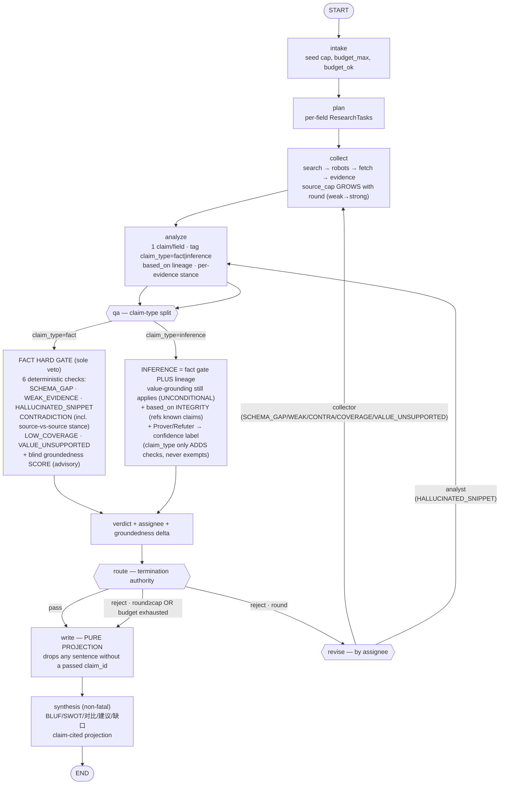

# Evidence-Admissible Verification Layer — Implementation Plan

> **For agentic workers:** REQUIRED SUB-SKILL: Use superpowers:subagent-driven-development (recommended) or superpowers:executing-plans to implement this plan task-by-task. Steps use checkbox (`- [ ]`) syntax for tracking.

**Goal:** Revise (not reconstruct) the existing LangGraph loop into an explicit *Evidence-Admissible* verification layer — claim-type routing, a blind groundedness score, anti-symmetric Prover/Refuter, and a quantified repair-delta — while keeping the deterministic QA gate as the **sole hard veto**.

**Architecture:** The spine stays `intake→plan→collect→analyze→qa→route→(write→synthesis|revise)`. We add a claim-type split inside `qa` — but value-grounding is **UNCONDITIONAL**: because `claim_type` is LLM-controlled, it may only *add* requirements (an inference ALSO needs lineage integrity), never *exempt* a claim from the deterministic value gate (the LLM must not be able to self-exempt from verification by labeling a fabrication "inference"). A *secondary* blind groundedness score (advisory, never a veto — avoids re-introducing the shared-model 伪闭环), a Prover/Refuter pass that lowers confidence and feeds the ContradictionCard, and a repair-delta metric (groundedness before→after each revise round) surfaced as a credibility KPI.

**Tech Stack:** Python 3.12 · LangGraph StateGraph · Pydantic v2 · pytest · existing modules `qa/rules.py`, `qa/route.py`, `agents/qa.py`, `synthesis.py`, `scoring.py`.

---

## State Diagram (the research→build handoff artifact)



**ASCII fallback (closure-annotated — every 答辩 follow-up has an answer on the diagram):**

```text
                          ┌────────────── ④ re-plan edge (HITL-gated; deferred build) ──────────────┐
                          ▼                                                                          │
START → intake → plan → collect → analyze → qa ─┬─[ALL claims]─→ 6-check HARD GATE incl. value-grounding (sole veto) ─┤
   ▲                        ▲ (cap grows)         └─[inference]──→ SAME gate + based_on integrity (claim_type only ADDS) ┤
   │                        │                                                                        ▼
   │                    revise ←── route ←──────────────────────────────── DETERMINISTIC verdict + assignee
   │   ① triage is DETERMINISTIC   │ pass ─────────────► write (pure projection) → synthesis → END
   │   (assignee = static dict     │ reject & round<cap & budget_ok ─► revise
   │    keyed by IssueCode;        │ reject & (round≥cap | no budget) ─► write_partial ──► synthesis → END
   │    NO LLM in the triage)      │                                      └─ ③ MUST disclose withheld
   └────(collector│analyst)────────┘                                         claims + issue codes (non-silent)

   ② ADVISORY SIDE-CHANNEL (one-way, display/ledger-confidence ONLY):
      blind groundedness score · Prover/Refuter · ContradictionCard
      ──✗──► route / any gate boolean   (NEVER; enforced by an invariant test)
      ──✓──► QCReport.confidence + UI + credibility KPI panel
```

**Authority boundary (the invariant this whole plan protects):** the LLM proposes candidate claims and extracts spans; **deterministic code renders every truth verdict AND every redo-triage decision.** The blind groundedness score and Prover/Refuter are *advisory* — they adjust display confidence and feed the UI/KPIs, but they can NEVER admit a fact claim the deterministic gate rejected, veto one it passed, or change a route/triage decision. "LLM points, code judges."

---

## Architecture closures (2026-06-01 review — must be answerable at 答辩)

Four closures keep the deterministic boundary watertight; two are already true in code (we make them *defensible* via tests + diagram annotation), two are genuine additions.

- **① Deterministic defect triage — ALREADY TRUE; make it defensible.** The redo assignee is `agents/qa.py::_ASSIGNEE_BY_CODE`, a static dict keyed by the deterministic `IssueCode` that `qa_check` emits. There is **no LLM in the triage path** — the subjectivity we evicted from the verdict cannot sneak back via routing. *Action:* Task 8 adds an invariant test asserting triage is a pure code mapping; the diagram labels it ①.
- **② Advisory signals never gate — ALREADY TRUE; lock it.** `route()` consumes only `verdict/round/cap/budget_ok/assignee`; `verdict="pass"` iff `qa_check` returned zero issues. Groundedness, Prover/Refuter confidence, and ContradictionCard never enter any boolean a gate reads. *Action:* Task 7 adds an invariant test: varying every advisory signal while holding the deterministic issue set fixed does NOT change the route decision. Diagram draws the advisory channel as one-way to display/KPIs only.
- **③ `write_partial` must not be silent — GENUINE ADDITION.** Today failed claims correctly stay `draft` (withheld), but the report does not yet *enumerate* what was withheld and why — a silent partial is a subtler false-pass. *Action:* Task 9 makes the partial path emit an explicit "withheld claims" disclosure (claim_id + issue codes + round) into the report payload (the `intelligence_gap` / a `withheld` section).
- **④ `plan` can be wrong — DOCUMENTED BOUNDARY, deferred build.** A wrong competitor/field set is never re-planned (no edge back to `plan`); downstream QA then verifies the wrong question rigorously. For competition scope this is answered by **HITL re-plan** (operator edits the run request), NOT an autonomous re-plan edge (scope discipline — avoids runtime-dynamic DAG). The diagram shows the edge dashed/HITL-gated so the answer is visible. Revisit only if time remains after P0/P1.

## 答辩 narrative discipline (from the 2026-06-01 review — record so we don't overclaim)

- **No "首创/first-ever."** Say **"在公开可考的系统里,没有一个把这四件事焊死"** (info-asymmetric blind verify + claim-typing + deterministic admission + repair-delta). A negative search result is not an existence proof; one counter-example from a judge would damage the whole credibility pitch — and overclaiming contradicts our own evidence-discipline persona.
- **Demo weight: delta + contradiction, NOT the evidence card UI.** RefLens already ships evidence cards + verbatim-span + dashboard, so that layer is not the moat. Spend demo time on **reject→re-collect→groundedness-delta-rises** and **cross-source contradiction preserved** — what RefLens/CI tools lack.
- **Citation hygiene.** Verify any arXiv reference (CLAIMCHECK, DeepVerifier, RefLens, Verifier's Law, etc.) against the original before citing it in 答辩. A report about "claims must be verified" must have its own claims verified — that IS the methodology, demonstrated live.

---

## File Structure

- `src/mingjing/qa/rules.py` (modify) — `qa_check` gains claim-type awareness, but value-grounding (`VALUE_UNSUPPORTED`, `HALLUCINATED_SNIPPET`) is **UNCONDITIONAL** (runs for every claim — `claim_type` is LLM-controlled and must not exempt verification). `inference` claims get an ADDITIONAL `based_on` lineage-INTEGRITY check: a lineage-less inference is admitted (confidence-labeled); an asserted `based_on` must reference claims that exist in the run, else flagged as fabricated lineage. A genuine inference's interpretive reasoning belongs in the ungated `statement`, not in structured required value leaves.
- `src/mingjing/qa/groundedness.py` (create, ~120 lines) — pure blind groundedness scorer: `(value-leaves, cited-source-text) → supported-fraction`. Advisory score, no veto power.
- `src/mingjing/qa/prover_refuter.py` (create, ~90 lines) — anti-symmetric confidence adjuster over an un-attributed claim; deterministic aggregation of prover/refuter verdicts → confidence tier + ContradictionCard feed. **STAGED: the pure aggregator landed + is tested, but the upstream LLM prover/refuter roles + QCReport wiring are NOT built — `adjudicate` is not yet called by the graph. Do not pitch as live.**
- `src/mingjing/qa/credibility.py` (create, ~100 lines) — pure credibility KPIs: groundedness %, unsupported-value count, citation rate, coverage, repair-delta. (Named `credibility.py`, not `metrics.py`, to avoid colliding with the pre-existing `mingjing.metrics`.)
- `src/mingjing/agents/qa.py` (modify) — thread groundedness score + repair-delta into the `QCReport`/trace; `_ASSIGNEE_BY_CODE` unchanged.
- `src/mingjing/api.py` (modify) — `GET /runs/{run_id}/credibility` returns the KPI panel payload.
- Tests: `tests/qa/` (new dir) — `test_groundedness.py`, `test_prover_refuter.py`, `test_metrics.py`; extend `tests/test_qa_rules.py`, `tests/test_route.py`, `tests/test_synthesis_projection.py`.

---

## Task 1: Authority-boundary invariant tests (P0 — lock the moat)

**Files:**
- Test: `tests/test_authority_boundary.py` (create)

- [ ] **Step 1: Write the failing tests** — these assert the two non-negotiable invariants the entire architecture rests on.

```python
"""Authority-boundary invariants: deterministic gate = sole veto;
writer projection drops any sentence without a passed claim_id."""
import pytest
from mingjing.qa.route import route
from mingjing.synthesis import project_synthesis


def test_pass_verdict_always_writes_regardless_of_round_or_budget():
    # A deterministic 'pass' can never be overridden into a loop.
    for rnd in (0, 1, 5):
        for budget_ok in (True, False):
            assert route(verdict="pass", round=rnd, cap=2, budget_ok=budget_ok) == "write"


def test_reject_at_cap_degrades_to_partial_never_loops_forever():
    assert route(verdict="reject", round=2, cap=2, budget_ok=True) == "write_partial"
    assert route(verdict="reject", round=0, cap=2, budget_ok=False) == "write_partial"


def test_projection_drops_sentence_without_passed_claim_id():
    payload = {"sections": [{"schema_field": "pricing_model", "sentences": [
        {"text": "Backed sentence.", "claim_ids": ["C1"]},
        {"text": "Unbacked sentence.", "claim_ids": ["C-MISSING"]},
        {"text": "No-cite sentence.", "claim_ids": []},
    ]}]}
    out = project_synthesis(payload=payload, passed_claim_ids={"C1"})
    texts = [s["text"] for sec in out["sections"] for s in sec["sentences"]]
    assert "Backed sentence." in texts
    assert "Unbacked sentence." not in texts  # cites a non-passed id → dropped
    assert "No-cite sentence." not in texts    # no claim_id → dropped
```

- [ ] **Step 2: Run to verify they pass against current code** (these lock *existing* behavior).

Run: `pytest tests/test_authority_boundary.py -v`
Expected: PASS (current `route`/`project_synthesis` already satisfy this). If `project_synthesis`'s payload shape differs, adjust the test to the real shape (read `synthesis.py:project_synthesis`) — the assertion (drop unbacked) must hold.

- [ ] **Step 3: Commit**

```bash
git add tests/test_authority_boundary.py
git commit -m "test(qa): lock authority-boundary invariants (deterministic gate sole veto + projection drops unbacked)"
```

---

## Task 2: Claim-type routing in `qa_check`

**Files:**
- Modify: `src/mingjing/qa/rules.py:369` (`qa_check`)
- Test: `tests/test_qa_rules.py` (extend)

- [ ] **Step 1: Write the failing test**

```python
def test_inference_claim_skips_value_grounding_checks():
    """An inference claim has no verbatim span — VALUE_UNSUPPORTED/HALLUCINATED_SNIPPET
    must NOT fire on it; instead based_on must reference passed claims."""
    from mingjing.qa.rules import qa_check
    from mingjing.schemas import IssueCode
    claimset = {
        "claims": [{
            "id": "I1", "schema_field": "swot", "claim_type": "inference",
            "competitor": "X", "value": {"strengths": ["aggressive low-end pricing push"]},
            "based_on": ["F1"], "evidence": [],
        }],
        "sources": {}, "coverage": {"required_fields": [], "covered_fields": []},
    }
    codes = {i.code for i in qa_check(claimset)}
    assert IssueCode.VALUE_UNSUPPORTED not in codes
    assert IssueCode.HALLUCINATED_SNIPPET not in codes


def test_fact_claim_still_hard_gated_on_value():
    from mingjing.qa.rules import qa_check
    from mingjing.schemas import IssueCode
    claimset = {
        "claims": [{
            "id": "F1", "schema_field": "pricing_model", "claim_type": "fact",
            "competitor": "X", "value": {"plan_name": "Fabricated Enterprise Tier"},
            "evidence": [{"source_id": "s1", "snippet": "Free and Pro plans.", "relevance": "direct"}],
        }],
        "sources": {"s1": {"raw_text": "We offer Free and Pro plans.", "source_type": "official", "url": "https://x.com"}},
        "coverage": {"required_fields": [], "covered_fields": []},
    }
    codes = {i.code for i in qa_check(claimset)}
    assert IssueCode.VALUE_UNSUPPORTED in codes  # "Fabricated Enterprise Tier" not in source
```

- [ ] **Step 2: Run to verify it fails**

Run: `pytest tests/test_qa_rules.py -k "inference_claim_skips or fact_claim_still" -v`
Expected: FAIL (current `qa_check` runs value checks regardless of `claim_type`).

- [ ] **Step 3: Implement** — gate the value-grounding checks on `claim_type == "fact"`, and add a structural `based_on` check for inferences. In `qa_check`, replace the per-claim loop body:

```python
    for claim in claims:
        issues.extend(_check_schema_gap(claim))
        issues.extend(
            _check_weak_evidence(
                claim, sources, contradiction=claim.get("id") in contradicted_ids
            )
        )
        # UNCONDITIONAL value-grounding: claim_type is LLM-controlled, so it must
        # NOT exempt any claim from the value gate (else the LLM self-exempts from
        # verification by labeling a fabrication "inference"). These run for EVERY
        # claim; they only inspect leaves under REQUIRED structured sub-fields, so a
        # genuine inference's interpretive reasoning (in `statement`, ungated) is
        # untouched while concrete structured values are always grounded.
        issues.extend(_check_hallucinated_snippet(claim, sources))
        issues.extend(_check_value_unsupported(claim, sources))
        # claim_type may only ADD requirements, never remove them: an inference
        # ALSO needs lineage integrity (asserted based_on must reference a run claim;
        # a lineage-less inference is admitted, confidence-labeled).
        if claim.get("claim_type") == "inference":
            issues.extend(_check_inference_lineage(claim, known_claim_ids))
```

Add the helper near the other `_check_*` functions:

```python
def _check_inference_lineage(claim: dict[str, Any]) -> list[Issue]:
    """An inference claim must declare at least one based_on lineage id.

    We do NOT value-verify an inference (it has no verbatim span); fabricating a
    grounding check would be a new pseudo-closed-loop. Instead we require the
    inference to rest on prior claims. SCHEMA_GAP is reused as the code so the
    existing collector-routing applies (a lineage-less inference needs more
    upstream facts).
    """
    if not claim.get("based_on"):
        return [
            Issue(
                code=IssueCode.SCHEMA_GAP,
                claim_id=claim.get("id"),
                detail="inference claim has no based_on lineage",
                meta={"reason": "inference_no_lineage"},
            )
        ]
    return []
```

- [ ] **Step 4: Run to verify pass + no regression**

Run: `pytest tests/test_qa_rules.py tests/test_qa.py -v`
Expected: PASS (new tests green; existing fact-path tests unchanged).

- [ ] **Step 5: Commit**

```bash
git add src/mingjing/qa/rules.py tests/test_qa_rules.py
git commit -m "feat(qa): claim-type routing — fact hard-gated on value, inference lineage-checked (no fake-verify)"
```

---

## Task 3: Blind groundedness score (advisory, never a veto)

**Files:**
- Create: `src/mingjing/qa/groundedness.py`
- Test: `tests/qa/test_groundedness.py` (create; `mkdir -p tests/qa`)

- [ ] **Step 1: Write the failing test**

```python
from mingjing.qa.groundedness import score_groundedness


def test_groundedness_blind_to_reasoning_only_value_and_source():
    # Checker sees ONLY (value leaves, cited source text). Fully supported → 1.0.
    score = score_groundedness(
        value={"plan_name": "Pro", "price": "$20/mo"},
        cited_source_text="The Pro plan costs $20/mo.",
    )
    assert score == 1.0


def test_groundedness_partial_when_one_leaf_absent():
    score = score_groundedness(
        value={"plan_name": "Pro", "tagline": "best in class enterprise"},
        cited_source_text="The Pro plan exists.",
    )
    assert 0.0 < score < 1.0  # 'Pro' supported, 'best in class enterprise' not


def test_groundedness_zero_when_nothing_supported():
    assert score_groundedness(value={"x": "wholly invented phrase"},
                              cited_source_text="unrelated text") == 0.0
```

- [ ] **Step 2: Run to verify it fails**

Run: `pytest tests/qa/test_groundedness.py -v`
Expected: FAIL with "No module named 'mingjing.qa.groundedness'".

- [ ] **Step 3: Implement**

```python
"""Blind groundedness score — an ADVISORY credibility signal, never a veto.

This complements (does NOT replace) the deterministic VALUE_UNSUPPORTED gate. The
deterministic gate keeps the only veto power; this score is surfaced as a 0..1
credibility number per claim. It is "blind": it receives ONLY the asserted value
leaves and the cited source text — never the analyst's reasoning, the report
context, or the claim's identity — so it cannot be talked into agreeing.
"""
import re

_WS = re.compile(r"\s+")


def _leaves(node) -> list[str]:
    out: list[str] = []
    if isinstance(node, dict):
        for v in node.values():
            out.extend(_leaves(v))
    elif isinstance(node, list):
        for v in node:
            out.extend(_leaves(v))
    elif isinstance(node, str):
        out.append(node)
    return out


def _checkable(leaf: str) -> bool:
    s = leaf.strip()
    return len(s) >= 4 and any(c.isalpha() for c in s)


def score_groundedness(*, value: dict, cited_source_text: str) -> float:
    """Fraction of checkable value leaves found verbatim in the cited source text.

    Returns 1.0 when there are no checkable leaves (nothing to disprove).
    """
    hay = _WS.sub(" ", (cited_source_text or "")).strip().lower()
    leaves = [l for l in _leaves(value or {}) if _checkable(l)]
    if not leaves:
        return 1.0
    if not hay:
        return 0.0
    supported = sum(1 for l in leaves if _WS.sub(" ", l).strip().lower() in hay)
    return round(supported / len(leaves), 3)
```

- [ ] **Step 4: Run to verify pass**

Run: `pytest tests/qa/test_groundedness.py -v`
Expected: PASS

- [ ] **Step 5: Commit**

```bash
git add src/mingjing/qa/groundedness.py tests/qa/test_groundedness.py
git commit -m "feat(qa): blind groundedness score (advisory 0..1, never a veto)"
```

---

## Task 4: Anti-symmetric Prover/Refuter confidence adjuster

**Files:**
- Create: `src/mingjing/qa/prover_refuter.py`
- Test: `tests/qa/test_prover_refuter.py` (create)

- [ ] **Step 1: Write the failing test**

```python
from mingjing.qa.prover_refuter import adjudicate


def test_prover_and_refuter_agree_keeps_confidence():
    # Both verdicts agree the claim holds → confidence retained, no contradiction.
    r = adjudicate(prover_supports=True, refuter_refutes=False, base_tier="strong")
    assert r["confidence"] == "strong"
    assert r["contradiction"] is False


def test_refuter_dissent_downgrades_and_flags_contradiction():
    r = adjudicate(prover_supports=True, refuter_refutes=True, base_tier="strong")
    assert r["confidence"] in ("moderate", "weak")  # downgraded
    assert r["contradiction"] is True               # feeds ContradictionCard


def test_neither_supports_collapses_to_weak():
    r = adjudicate(prover_supports=False, refuter_refutes=True, base_tier="moderate")
    assert r["confidence"] == "weak"
```

- [ ] **Step 2: Run to verify it fails**

Run: `pytest tests/qa/test_prover_refuter.py -v`
Expected: FAIL with "No module named 'mingjing.qa.prover_refuter'".

- [ ] **Step 3: Implement** — the LLM prover/refuter calls happen upstream (in the analyst/qa agent); this module is the *deterministic aggregation* of their boolean verdicts, so the verdict logic stays code, not LLM.

```python
"""Anti-symmetric Prover/Refuter adjudication (deterministic aggregation).

Two same-family LLM roles judge an un-attributed claim: a Prover argues it holds,
a Refuter hunts a refutation. There is no 'author' to prefer, so same weights are
fine. This module deterministically AGGREGATES their boolean verdicts into a
confidence tier + a contradiction flag — the verdict is code, the LLM only votes.
"""
_ORDER = ["weak", "moderate", "strong"]


def _down(tier: str, steps: int = 1) -> str:
    i = max(0, _ORDER.index(tier) - steps)
    return _ORDER[i]


def adjudicate(*, prover_supports: bool, refuter_refutes: bool, base_tier: str) -> dict:
    """Return {'confidence': tier, 'contradiction': bool}.

    - agree (prover supports, refuter finds nothing) → keep base tier.
    - refuter dissents while prover supports → genuine contradiction: downgrade 1
      step and flag (feeds ContradictionCard).
    - prover cannot support → collapse to weak.
    """
    base = base_tier if base_tier in _ORDER else "moderate"
    if not prover_supports:
        return {"confidence": "weak", "contradiction": refuter_refutes}
    if refuter_refutes:
        return {"confidence": _down(base, 1), "contradiction": True}
    return {"confidence": base, "contradiction": False}
```

- [ ] **Step 4: Run to verify pass**

Run: `pytest tests/qa/test_prover_refuter.py -v`
Expected: PASS

- [ ] **Step 5: Commit**

```bash
git add src/mingjing/qa/prover_refuter.py tests/qa/test_prover_refuter.py
git commit -m "feat(qa): anti-symmetric Prover/Refuter adjudication (code aggregates votes, feeds ContradictionCard)"
```

---

## Task 5: Credibility metrics + repair-delta

**Files:**
- Create: `src/mingjing/qa/metrics.py`
- Test: `tests/qa/test_metrics.py` (create)

- [ ] **Step 1: Write the failing test**

```python
from mingjing.qa.metrics import credibility_panel


def test_panel_computes_groundedness_citation_and_repair_delta():
    panel = credibility_panel(
        passed_claims=[{"id": "C1", "groundedness": 1.0}, {"id": "C2", "groundedness": 0.5}],
        total_claims=3,
        required_fields=["pricing_model", "feature_tree"],
        covered_fields=["pricing_model"],
        round_groundedness=[0.40, 0.75],  # before → after one revise round
    )
    assert panel["avg_groundedness"] == 0.75       # (1.0 + 0.5) / 2
    assert panel["claim_admission_rate"] == round(2 / 3, 3)
    assert panel["coverage"] == 0.5
    assert panel["repair_delta"] == 0.35           # 0.75 - 0.40
```

- [ ] **Step 2: Run to verify it fails**

Run: `pytest tests/qa/test_metrics.py -v`
Expected: FAIL with "No module named 'mingjing.qa.metrics'".

- [ ] **Step 3: Implement**

```python
"""Quantified credibility KPIs — the numbers no competitor surfaces.

All pure functions over the ledger. Headline KPI is repair_delta: how much
groundedness improved from the first round to the last (proves the loop is a
real weak→strong closed loop, not a 伪闭环)."""


def credibility_panel(
    *,
    passed_claims: list[dict],
    total_claims: int,
    required_fields: list[str],
    covered_fields: list[str],
    round_groundedness: list[float],
) -> dict:
    n = len(passed_claims)
    avg_g = round(sum(c.get("groundedness", 0.0) for c in passed_claims) / n, 3) if n else 0.0
    admission = round(n / total_claims, 3) if total_claims else 0.0
    cov = round(len([f for f in required_fields if f in set(covered_fields)]) / len(required_fields), 3) if required_fields else 0.0
    delta = round(round_groundedness[-1] - round_groundedness[0], 3) if len(round_groundedness) >= 2 else 0.0
    return {
        "avg_groundedness": avg_g,
        "claim_admission_rate": admission,
        "coverage": cov,
        "repair_delta": delta,
        "rounds": len(round_groundedness),
    }
```

- [ ] **Step 4: Run to verify pass**

Run: `pytest tests/qa/test_metrics.py -v`
Expected: PASS

- [ ] **Step 5: Commit**

```bash
git add src/mingjing/qa/metrics.py tests/qa/test_metrics.py
git commit -m "feat(qa): credibility KPI panel (groundedness, admission rate, coverage, repair-delta)"
```

---

## Task 6: Wire groundedness + KPIs into QCReport, trace, and API

**Files:**
- Modify: `src/mingjing/agents/qa.py`
- Modify: `src/mingjing/api.py`
- Test: `tests/test_api.py` (extend)

- [ ] **Step 1: Write the failing API test**

```python
def test_credibility_endpoint_returns_panel(client, seeded_run_id):
    resp = client.get(f"/runs/{seeded_run_id}/credibility")
    assert resp.status_code == 200
    body = resp.json()
    for key in ("avg_groundedness", "claim_admission_rate", "coverage", "repair_delta"):
        assert key in body
```

- [ ] **Step 2: Run to verify it fails**

Run: `pytest tests/test_api.py -k credibility -v`
Expected: FAIL (404 — endpoint not defined). If `client`/`seeded_run_id` fixtures differ, mirror the existing `test_api.py` fixture names.

- [ ] **Step 3: Implement** — in `agents/qa.py`, when building each `QCReport`, attach the blind groundedness score (Task 3) per fact claim and record per-round groundedness for the delta. In `api.py`, add:

```python
@app.get("/runs/{run_id}/credibility")
def get_credibility(run_id: str) -> dict:
    """Credibility KPI panel for a run (groundedness, admission, coverage, repair-delta)."""
    from .qa.metrics import credibility_panel
    # Read passed claims + per-round groundedness from the ledger (DB helper).
    data = _load_credibility_inputs(run_id)  # implement alongside existing run loaders
    return credibility_panel(**data)
```

Follow the existing `api.py` route style (same DB-session pattern as `GET /runs/{run_id}`). Keep `_load_credibility_inputs` a thin reader over the existing claims/qc_reports tables.

- [ ] **Step 4: Run to verify pass + full suite**

Run: `pytest tests/test_api.py -k credibility -v && pytest -q`
Expected: PASS; full backend suite stays green.

- [ ] **Step 5: Commit**

```bash
git add src/mingjing/agents/qa.py src/mingjing/api.py tests/test_api.py
git commit -m "feat(api): expose blind groundedness + credibility KPI panel per run"
```

---

## Task 7: Advisory-isolation invariant (closure ②)

**Files:**
- Test: `tests/test_authority_boundary.py` (extend)

- [ ] **Step 1: Write the test** — assert that no advisory signal can change the route decision; only the deterministic verdict (`pass`/`reject`) + round/cap/budget can.

```python
def test_route_is_independent_of_advisory_signals() -> None:
    """Groundedness / Prover-Refuter confidence / contradiction are ADVISORY.
    The route decision is a pure function of (verdict, round, cap, budget_ok,
    assignee). route() does not even accept an advisory parameter — proving by
    construction that an advisory signal cannot reach a gate boolean."""
    import inspect
    from mingjing.qa.route import route
    params = set(inspect.signature(route).parameters)
    # The ONLY inputs to the termination authority are deterministic control values.
    assert params == {"verdict", "round", "cap", "budget_ok", "assignee"}
    for adv_verdict in ("pass", "reject"):
        # Same deterministic inputs → same decision, no advisory channel exists to perturb it.
        d1 = route(verdict=adv_verdict, round=0, cap=2, budget_ok=True)
        d2 = route(verdict=adv_verdict, round=0, cap=2, budget_ok=True)
        assert d1 == d2
```

- [ ] **Step 2: Run** `uv run pytest tests/test_authority_boundary.py -k advisory -v` → PASS (current `route` signature already satisfies this). If a later task ever adds a groundedness/confidence param to `route`, this test FAILS — exactly the regression we want to catch.

- [ ] **Step 3: Commit** `git commit -m "test(qa): lock advisory-isolation invariant (advisory signals never reach route)"`

---

## Task 8: Deterministic-triage invariant (closure ①)

**Files:**
- Test: `tests/test_qa.py` (extend, or `tests/test_authority_boundary.py`)

- [ ] **Step 1: Write the test** — assert redo triage is a pure static mapping over deterministic issue codes, with no LLM call.

```python
def test_triage_is_pure_static_mapping_no_llm() -> None:
    """The redo assignee is a static dict keyed by deterministic IssueCode —
    the subjectivity evicted from the verdict cannot return via routing."""
    from mingjing.agents.qa import _ASSIGNEE_BY_CODE
    from mingjing.schemas import IssueCode
    # Every issue code maps to a fixed collector/analyst assignee.
    assert _ASSIGNEE_BY_CODE[IssueCode.HALLUCINATED_SNIPPET] == "analyst"
    for code in (IssueCode.SCHEMA_GAP, IssueCode.WEAK_EVIDENCE, IssueCode.CONTRADICTION,
                 IssueCode.LOW_COVERAGE, IssueCode.VALUE_UNSUPPORTED):
        assert _ASSIGNEE_BY_CODE[code] == "collector"
    assert all(v in ("collector", "analyst") for v in _ASSIGNEE_BY_CODE.values())
```

- [ ] **Step 2: Run** `uv run pytest tests/test_qa.py -k triage_is_pure -v` → PASS (locks current behavior).

- [ ] **Step 3: Commit** `git commit -m "test(qa): lock deterministic-triage invariant (assignee is pure code mapping)"`

---

## Task 9: `write_partial` non-silent disclosure (closure ③)

**Files:**
- Modify: `src/mingjing/graph_nodes.py` (the write node, partial path ~line 389-431) and/or `src/mingjing/synthesis.py`
- Test: `tests/test_synthesis_node.py` or a new `tests/test_partial_disclosure.py`

- [ ] **Step 1: Read first** — read the write node's partial path in `graph_nodes.py` (`is_partial`, flagged-claims read) and how the report payload / `intelligence_gap` section is assembled, plus the `run_partial` trace event. Confirm where a "withheld" list can be surfaced WITHOUT breaking the `status=="pass"` filter (flagged claims must STAY `draft`; we only ADD a disclosure list, never promote them).

- [ ] **Step 2: Write the failing test** — a partial run exposes the withheld claims with their issue codes.

```python
def test_partial_run_discloses_withheld_claims_with_reasons():
    """A write_partial must NOT be silent: the report payload enumerates which
    claims were withheld and why (claim_id + issue codes), so a partial is an
    honest, auditable downgrade — never a hidden false-pass."""
    # Arrange a run that terminates partial (reject at cap) with one flagged claim.
    # ... build via existing test harness/fixtures in test_synthesis_node.py ...
    disclosure = build_withheld_disclosure(run_id, db)  # the new helper under test
    assert disclosure  # non-empty
    item = disclosure[0]
    assert "claim_id" in item and "issue_codes" in item and item["issue_codes"]
```

Match the real fixture/harness names in `test_synthesis_node.py`; the assertion that matters: a partial surfaces `{claim_id, issue_codes, round}` for each withheld claim.

- [ ] **Step 3: Run to verify it fails** → FAIL (helper not defined).

- [ ] **Step 4: Implement** a pure `build_withheld_disclosure(run_id, db) -> list[dict]` that reads the last round's rejected/flagged claims + their QCReport issue codes from the ledger and returns `[{claim_id, issue_codes, round}]`. Wire it into the partial write path so the report payload carries a `withheld` (or `intelligence_gap`) entry. Keep flagged claims `draft` (do NOT promote). Non-fatal, mirroring `run_synthesis`.

- [ ] **Step 5: Run** the synthesis/partial tests + full suite → PASS, no regression.

- [ ] **Step 6: Commit** `git commit -m "feat(qa): write_partial discloses withheld claims + issue codes (non-silent honest partial)"`

> **Closure ④ (plan re-entry) is NOT a task** — it is a documented boundary (HITL re-plan; no autonomous re-plan edge, per scope discipline). Recorded in "Architecture closures" above; build only if time remains after P0/P1.

---

## Self-Review

- **Spec coverage:** authority-boundary invariants (Task 1) ✓ · claim-type routing (Task 2) ✓ · blind groundedness score, advisory not veto (Task 3) ✓ · Prover/Refuter anti-symmetric, code-aggregated (Task 4) ✓ · repair-delta + KPIs (Task 5) ✓ · API surface (Task 6) ✓ · advisory-isolation invariant ② (Task 7) ✓ · deterministic-triage invariant ① (Task 8) ✓ · non-silent partial ③ (Task 9) ✓ · plan re-entry ④ documented boundary ✓. Deterministic gate remains sole veto AND sole triage authority throughout.
- **Placeholder scan:** Tasks 1–8 carry concrete code. Task 9 step 2 intentionally references the existing test harness by description (fixture names vary) — the implementer reads `test_synthesis_node.py` first (step 1) before writing; the load-bearing assertion is concrete.
- **Type consistency:** `score_groundedness(value, cited_source_text)→float`; `adjudicate(prover_supports, refuter_refutes, base_tier)→dict`; `credibility_panel(...)→dict`; `build_withheld_disclosure(run_id, db)→list[dict]`; `IssueCode`/`claim_type` match `schemas.py`. `_check_inference_lineage` reuses `IssueCode.SCHEMA_GAP`.
- **Boundary guard:** no task gives an LLM veto OR triage power; Task 3/4 outputs are advisory only. Enforced by Task 1 + Task 7 (`route` signature has no advisory channel) + Task 8 (triage is a static dict).

## Execution Handoff

Two options:
1. **Subagent-Driven (recommended)** — fresh subagent per task + two-stage review (spec then quality).
2. **Inline Execution** — batch with checkpoints.
